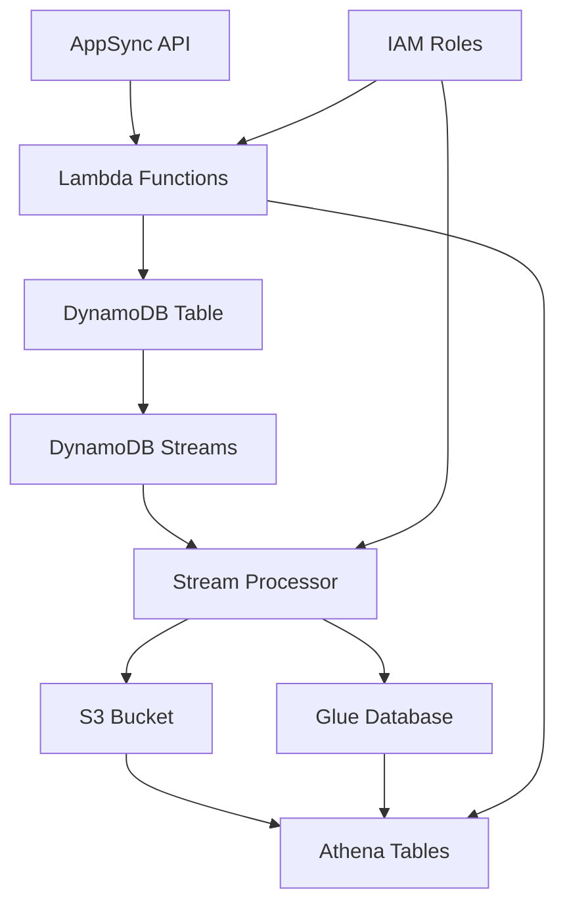

# Architecture Overview

OC-GraphQL is a serverless-first architecture designed for scalability, performance, and cost-effectiveness. This document explains the complete system design and component relationships.

## 🏗️ High-Level Architecture

```
┌─────────────────┐    ┌──────────────┐    ┌─────────────────┐
│   GraphQL API   │────│   Lambda     │────│   DynamoDB      │
│   (AppSync)     │    │  Functions   │    │    Table        │
└─────────────────┘    └──────────────┘    └─────────────────┘
                              │                       │
                              │                       │
                              ▼                       ▼
                    ┌──────────────┐         ┌─────────────────┐
                    │   Athena     │◄────────│  DynamoDB       │
                    │   Tables     │         │   Streams       │
                    └──────────────┘         └─────────────────┘
                              │                       │
                              │                       │
                              ▼                       ▼
                    ┌──────────────┐         ┌─────────────────┐
                    │  S3 Parquet  │◄────────│  Python Stream  │
                    │  Data Lake   │         │   Processor     │
                    └──────────────┘         └─────────────────┘
```

## 🔄 Data Flow Architecture

### 1. **Request Processing Layer**

```
Client Request → AppSync → Lambda Resolver → DynamoDB
                      ↓
                 Custom Logic (SQL Queries via Athena)
```

**Components:**

- **AppSync GraphQL API**: Entry point for all GraphQL operations
- **Lambda Resolvers**: Business logic and data processing
- **DynamoDB**: Primary operational data store

### 2. **Analytics Processing Layer**

```
DynamoDB → Streams → Python Processor → Parquet Files → Athena Tables
                                     ↓
                              Intelligent Type Detection
                                     ↓
                              SNAPPY Compression
```

**Components:**

- **DynamoDB Streams**: Real-time change capture
- **Python Stream Processor**: Parquet conversion and optimization
- **S3 Parquet Storage**: Columnar analytics storage
- **Glue Tables**: Metadata and schema management

## 📊 Component Deep Dive

### GraphQL Layer (AppSync)

**Purpose**: API Gateway and GraphQL execution engine

**Features:**

- Automatic CRUD operations generation
- Custom resolver attachment
- Real-time subscriptions support
- API key authentication
- Request/response caching

**Generated Resolvers:**

```typescript
// Auto-generated for each entity type
Query.readUser → Lambda → DynamoDB.GetItem
Mutation.createUser → Lambda → DynamoDB.PutItem
User.posts → Lambda → Athena.Query
```

### Lambda Functions Architecture

**Function Types & Patterns:**

#### 1. **CRUD Functions** (Node.js 18.x)

```
Pattern: OCG-{project}-{operation}-{entity}
Examples:
- OCG-blog-create-user
- OCG-blog-read-post
- OCG-blog-update-comment
```

#### 2. **Query Functions** (Node.js 18.x)

```
Pattern: OCG-{project}-query-{queryName}
Examples:
- OCG-blog-query-getPublishedPosts
- OCG-blog-query-searchUsers
```

#### 3. **Resolver Functions** (Node.js 18.x)

```
Pattern: OCG-{project}-resolver-{typeName}
Examples:
- OCG-blog-resolver-postconnection
- OCG-blog-resolver-useranalytics
```

#### 4. **Field Resolver Functions** (Node.js 18.x)

```
Pattern: OCG-{project}-field-{typeName}-{fieldName}
Examples:
- OCG-blog-field-user-totalPosts
- OCG-blog-field-post-likeCount
```

#### 5. **Stream Processor** (Python 3.11)

```
Pattern: OCG-{project}-stream-processor
Example: OCG-blog-stream-processor
```

### Data Storage Architecture

#### Primary Storage (DynamoDB)

**Table Design:**

- **Single Table Pattern**: One table per project
- **Composite Keys**:
  - `PK`: Primary identifier
  - `SK`: Sort key for relationships
- **Stream Configuration**: NEW_AND_OLD_IMAGES

**Key Patterns:**

```
Regular Entities:
PK: "entity#id", SK: "entity#id"
Example: PK: "user#123", SK: "user#123"

Join Tables (Relationships):
PK: "relation#table#entity1#id", SK: "relation#table#entity2#id"
Example: PK: "relation#user_posts#user#123", SK: "relation#user_posts#post#456"
```

#### Analytics Storage (S3 Parquet)

**Storage Structure:**

```
s3://{project}-{account-id}/
├── tables/
│   ├── user/
│   │   └── year=2024/month=12/day=15/
│   │       ├── user-123.parquet
│   │       └── user-456.parquet
│   ├── post/
│   │   └── year=2024/month=12/day=15/
│   │       └── post-789.parquet
│   └── user_posts/  # Join table
│       └── year=2024/month=12/day=15/
│           └── user_123_post_456.parquet
└── athena-results/
    └── query-results/
```

**Parquet Optimization:**

- **Format**: Columnar Parquet with SNAPPY compression
- **Compression Ratio**: 90-98% size reduction vs JSON
- **Type Optimization**:
  - Timestamps → `timestamp(ns, tz=UTC)`
  - Numbers → `int8/int16/int32` or `float32`
  - Strings → Dictionary encoded
  - Booleans → Bit-packed

### Stream Processing Architecture

**Python-Based Processor Features:**

#### Real-time Processing

```python
DynamoDB Event → Python Lambda → Parquet Processing → S3 Upload
                       ↓
                Intelligent Type Detection
                       ↓
                Schema Evolution Support
```

#### Processing Logic

1. **Event Detection**: INSERT, MODIFY, REMOVE operations
2. **Data Transformation**: DynamoDB → pandas DataFrame
3. **Type Optimization**: Automatic data type inference
4. **Parquet Generation**: PyArrow with SNAPPY compression
5. **S3 Upload**: Partitioned storage with metadata
6. **Glue Integration**: Automatic table creation/updates

#### Supported Operations

```python
CREATE: item → df → parquet → s3 → glue_table
UPDATE: item → df → parquet → s3 (overwrite)
DELETE: item → s3.delete(parquet_file)
```

## 🔧 Infrastructure Components

### AWS Services Used

#### Core Services

- **AWS AppSync**: GraphQL API management
- **AWS Lambda**: Serverless compute (Node.js + Python)
- **Amazon DynamoDB**: Primary database with streams
- **Amazon S3**: Data lake storage
- **AWS Glue**: Data catalog and metadata
- **Amazon Athena**: Analytics query engine

#### Supporting Services

- **AWS IAM**: Access control and permissions
- **Amazon CloudWatch**: Monitoring and logging
- **AWS CloudFormation**: Infrastructure as code
- **AWS CDK**: Infrastructure deployment tool

### Resource Relationships



## 🚀 Scalability & Performance

### Auto-Scaling Components

#### DynamoDB

- **Billing Mode**: Pay-per-request (auto-scaling)
- **Stream Configuration**: Automatic shard management
- **Backup**: Point-in-time recovery

#### Lambda Functions

- **Concurrency**: Automatic scaling (up to account limits)
- **Memory**: 128MB (CRUD) to 1024MB (Stream Processor)
- **Timeout**: 30s (CRUD) to 5 minutes (Complex queries)

#### S3 Storage

- **Partitioning**: Date-based automatic partitioning
- **Compression**: SNAPPY for optimal query performance
- **Lifecycle**: Configurable archival policies

### Performance Characteristics

#### Query Performance

```
Operation Type          Response Time    Throughput
CRUD Operations         50-200ms         1000+ RPS
Simple SQL Queries      200-500ms        100+ RPS
Complex Analytics       1-5 seconds      10+ RPS
Partition Pruning       100-300ms        500+ RPS
```

#### Storage Performance

```
Format          Size vs JSON    Query Speed     Cost vs JSON
Raw JSON        100%            1x              100%
Parquet         2-10%           50-100x         5-20%
```

## 🔒 Security Architecture

### Access Control

- **API Authentication**: AppSync API Key (configurable)
- **Function Permissions**: Least-privilege IAM roles
- **Data Encryption**:
  - At rest: S3 server-side encryption
  - In transit: HTTPS/TLS 1.2+

### SQL Injection Protection

```javascript
// Built-in parameter sanitization
function escapeSqlValue(value) {
  if (typeof value === "string") {
    return "'" + value.split("'").join("''") + "'";
  }
  // Type-specific handling...
}
```

## 📈 Cost Model

### Resource Costs (Typical Usage)

```
Service             Cost Factor              Optimization
DynamoDB           Read/Write operations     Single-table design
Lambda             Execution time/memory     Efficient code generation
S3                 Storage volume            90%+ compression
Athena             Data scanned             Partition pruning
Glue               Catalog operations        Minimal table updates
```

### Cost Optimization Strategies

1. **Parquet Storage**: 90-98% size reduction
2. **Partition Projection**: Eliminates Glue crawlers
3. **Single Table Design**: Minimizes DynamoDB costs
4. **Efficient Lambda Memory**: Right-sized allocations
5. **Query Optimization**: Reduced Athena scanning

---

This architecture provides enterprise-grade scalability while maintaining serverless cost-effectiveness and operational simplicity.
